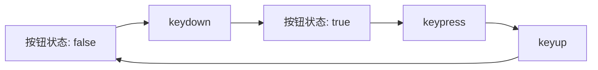

[TOC]


## 关于

利用`joy-con`和[WebHID API](https://wicg.github.io/webhid/)尝试做一些有意思的交互；这里正好有人封装了一个基于`WebHID API`来连接`joy-con`设备的库：

- [tomayac/joy-con-webhid: Use the Nintendo Switch Joy-Cons via the WebHID API](https://github.com/tomayac/joy-con-webhid)

关于如何在电脑上用蓝牙连接`joy-con`设备，可以参考这个教程：

- [joycon 手柄连接电脑教程 - 哔哩哔哩](https://www.bilibili.com/read/cv10678893?from=search)

只要`joy-con`设备能被电脑蓝牙识别连接，后续打开`joy-con`就能自动连接到电脑蓝牙；


## joy-con-webhid 库的一些用法

由于`joy-con-webhid`作者并没有提供直接的`API`文档，不过好在源码代码和注释写的很清晰，可以**直接看源码**来参考使用方法；

### 坑

- 在使用`pnpm`安装该包，发现其打包的`dist`目录缺失了一些文件，所以不能直接使用；不过可以复制其`src`目录文件作为模块使用，因为其源码并不包含第三方包；

  

  

- 

### hidinput 事件

该事件为`HID`设备传送数据的事件，当`HID`设备（即`joycon`手柄）发生**状态变化**时（如按钮触发，`IMU`传感器数据变化等）会触发该事件，利用该事件的数据就可以进一步判断当前的输入；

该事件是一个`CustomEvent`，其`detail`字段主要的包含的数据如下（完整数据可以参考源码[^1]）：

```typescript
/** 主要输入数据 */
interface CommonInput {
  /** 平滑后（三个原始采样数据平均）的加速度计数据 */
  actualAccelerometer: CommonVector
  /**
   * 平滑后的陀螺仪数据
   * https://learn.sparkfun.com/tutorials/gyroscope/all
   */
  actualGyroscope: {
    /** degrees per second (°/s)  */
    dps: CommonVector
    /** revolutions per second */
    rps: CommonVector
  }
  /** 平滑后的设备朝向数据 */
  actualOrientation: CommonQuaternion
  actualOrientationQuaternion: CommonQuaternion
  quaternion: Quaternion
}
```

由于左右两个`joycon`的按钮功能不同，所以专门用来记录按钮按压状态的`buttonStatus`字段根据左右各不相同，如：

```typescript
/** left joy-con 按钮状态；key为按钮名称，value为是否处于按压 */
export interface LeftButtonStatus {
  capture: boolean
  chargingGrip: boolean
  down: boolean
  l: boolean
  left: boolean
  leftStick: boolean
  minus: boolean
  right: boolean
  sl: boolean
  sr: boolean
  up: boolean
  zl: boolean
}

/** left joy-con 输入数据 */
export interface LeftInput extends CommonInput {
  /** 按钮状态 */
  buttonStatus: LeftButtonStatus
}
```


#### actualOrientation

可以推断这里的数据应该类似于[RelativeOrientationSensor](https://developer.mozilla.org/en-US/docs/Web/API/RelativeOrientationSensor)（理由就是实测设备旋转后静止数据会回归初始状态，因此应该不是一个绝对的朝向），是一种设备朝向的旋转数据，三个分量应该就是欧拉角，从库的实例源码[^2]可以得知欧拉角的顺序为$(z, x, y)$；

- [如何通俗地解释欧拉角？之后为何要引入四元数？ - 大脸怪的回答 - 知乎](https://www.zhihu.com/question/47736315/answer/236808639)：比较详细的讲解了欧拉角和四元数的区别，以及各种欧拉角和四元数的基本性质等

### rumble

这是一个封装了向`joycon`发送震动指令的方法：


## 操作识别

### 布尔按钮

根据`joycon`的设计可知，除了摇杆以外的按钮都是一个布尔状态；不过实际中使用的时候直接用按钮的布尔状态实在是不太方便，因此这里可以参照`DOM`为键盘设计的事件，将按键按压过程分为`keydown`、`keypress`和`keyup`三个阶段：



这里只需要记录上一个`hidinput`当中的每个按钮的状态，然后在当前`hidinput`事件处理时对比一下之前的按钮状态即可完成上述三种事件的转化；


### 摇杆

#### 精确方向


#### 轴方向


### 体感控制

#### 固定方向晃动


### 特定手势

- [(PDF) Gesture Recognition with a Wii Controller](https://www.researchgate.net/publication/30012906_Gesture_Recognition_with_a_Wii_Controller)：基于机器学习的思路对加速度传感器数据进行筛选、分类，最终得到一个最接近的手势；


## 相关

[redphx/joydance: Use Joy-Cons to play Ubisoft's Just Dance on all platforms](https://github.com/redphx/joydance)：一个基于python的库，原理也是利用HID协议连接joycon获取其数据，并转发到舞力全开软件


[^1]: [joy-con-webhid/parse.js at main · tomayac/joy-con-webhid](https://github.com/tomayac/joy-con-webhid/blob/main/src/parse.js)
[^2]: https://github.com/tomayac/joy-con-webhid/blob/518a5d34d585e1844b6daf42310b975ab2631835/demo/style.css#L112
